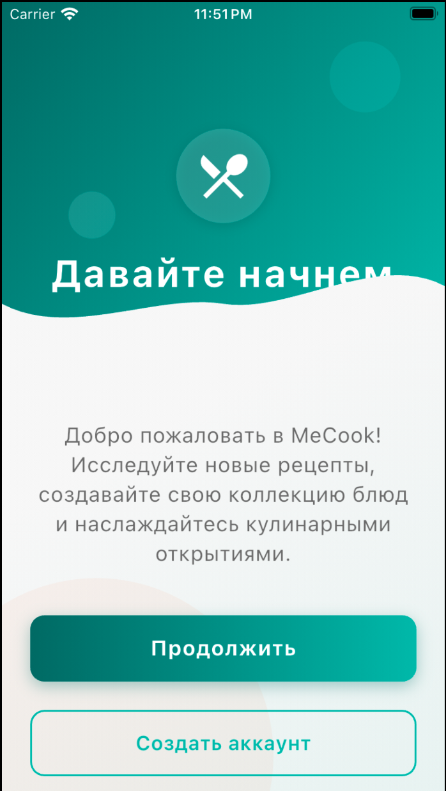

sc<h1 align="center">MeCook</h1>

<div align="center">
  
  
  
</div>

## Содержание
- [О проекте](#о-проекте)
- [Скриншоты](#скриншоты)
- [Основные функции](#основные-функции)
- [Технологический стек](#технологический-стек)
- [Установка и запуск](#установка-и-запуск)
- [Структура проекта](#структура-проекта)
- [Поддерживаемые платформы](#поддерживаемые-платформы)
- [Как внести свой вклад](#как-внести-свой-вклад)
- [Лицензия](#лицензия)

## О проекте

MeCook — это современное мобильное приложение для поиска и организации кулинарных рецептов. 
Приложение позволяет находить рецепты по ингредиентам, которые у вас есть дома, 
и сохранять понравившиеся блюда в разделе "Избранное".

## Скриншоты

> ⚠️ **Важное примечание:**
> 
> В данный момент скриншоты приложения отображают интерфейс без данных с сервера, так как:
> - Сервер находится в процессе разработки/тестировании
> - Демонстрируется базовая структура приложения
> - Показан дизайн пользовательского интерфейса
>
> В релизной версии все экраны будут заполнены актуальной информацией.

<div align="center">
  
  
  
  
</div>

## Основные функции

- **Поиск рецептов по ингредиентам**: найдите блюда, которые можно приготовить из имеющихся продуктов
- **Фильтрация по странам**: исследуйте кулинарные традиции различных кухонь мира с удобным интерфейсом
- **Избранные рецепты**: сохраняйте понравившиеся блюда для быстрого доступа
- **Система авторизации**: создайте аккаунт для синхронизации избранных рецептов между устройствами
- **Современный дизайн**: удобный и привлекательный пользовательский интерфейс

## Технологический стек

<div align="center">
<table>
  <tr>
    <td align="center"><strong>Технология</strong></td>
    <td align="center"><strong>Назначение</strong></td>
  </tr>
  <tr>
    <td>Flutter 3.29.0</td>
    <td>Основной фреймворк разработки</td>
  </tr>
  <tr>
    <td>Dart 3.7.0</td>
    <td>Язык программирования</td>
  </tr>
  <tr>
    <td>Provider</td>
    <td>Управление состоянием приложения</td>
  </tr>
  <tr>
    <td>HTTP</td>
    <td>Взаимодействие с бэкенд-сервером</td>
  </tr>
  <tr>
    <td>SharedPreferences</td>
    <td>Хранение пользовательских данных</td>
  </tr>
</table>
</div>

## Установка и запуск

### Требования к системе

- Flutter SDK 3.0.0+
- Dart SDK 3.0.0+
- Android Studio / VS Code с плагинами для Flutter
- 2 ГБ свободной памяти устройства
- Доступ к интернету

### Установка и настройка

#### 1. Клонирование репозитория

```bash
git clone https://github.com/Fritbyte/mecook-app.git
cd mecook-app
```

#### 2. Установка зависимостей

```bash
flutter pub get
```

#### 3. Запуск приложения

```bash
flutter run
```

#### 4. Сборка релиза

Для создания релизной версии APK:

```bash
flutter build apk --release
```

Готовый APK-файл будет находиться в `build/app/outputs/flutter-apk/app-release.apk`

## Структура проекта

```
lib/
├── app.dart                # Корневой виджет приложения
├── app_routes.dart         # Маршрутизация приложения
├── di.dart                 # Внедрение зависимостей
├── main.dart               # Точка входа в приложение
├── common_widgets/         # Общие виджеты для переиспользования
├── core/                   # Базовая логика и утилиты
└── features/               # Функциональные модули
    ├── auth/               # Аутентификация
    │   ├── data/           # Слой данных
    │   ├── domain/         # Бизнес-логика
    │   └── presentation/   # UI компоненты
    ├── recipes/            # Функционал рецептов
    │   ├── data/
    │   ├── domain/
    │   └── presentation/
    └── splash/             # Экран загрузки
        └── presentation/
```

## Поддерживаемые платформы

- Android
- iOS

## Как внести свой вклад

1. Создайте форк проекта
2. Создайте ветку для своей функции (`git checkout -b feature/amazing-feature`)
3. Зафиксируйте изменения (`git commit -m 'Добавлена новая функция'`)
4. Отправьте изменения в ветку (`git push origin feature/amazing-feature`)
5. Откройте Pull Request

## Лицензия

Проект распространяется под лицензией MIT. Подробности в файле [LICENSE](LICENSE).
